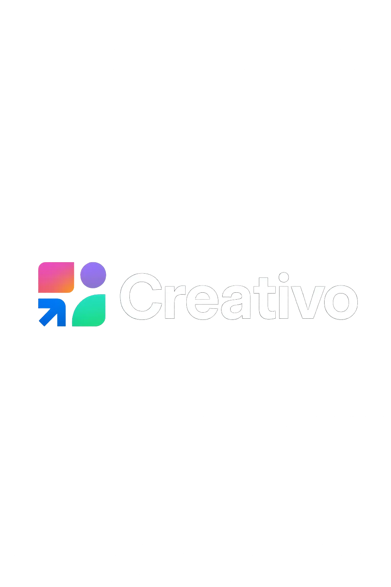

# 🎨 Creativo - AI Creative Studio

<div align="center">
  
  
  **Next-Generation AI Creative Suite for Content Creation**
  
  [](https://reactjs.org/)
  [](https://nodejs.org/)
  [](https://tailwindcss.com/)
  [](https://openai.com/)
  [](https://clerk.dev/)
  [](LICENSE)

[🚀 Live Demo](https://your-demo-link.com) • [📖 Documentation](docs/) • [🐛 Report Bug](issues/) • [💡 Request Feature](issues/)

</div>

---

## 📸 Preview Gallery

<div align="center">
  
### 🏠 Dashboard Overview


### ✨ AI Content Generation


### 🖼️ Image Editing Tools


### 🎨 Creative Templates


### 📤 Export & Share Options


</div>

---

## 🌟 Features

### 🤖 AI-Powered Tools

- **📝 Article Writer** - Generate high-quality articles with customizable length
- **📰 Blog Title Generator** - Create engaging blog titles for any niche
- **🎨 AI Image Generator** - Generate stunning images with multiple art styles
- **🖼️ Background Remover** - Remove image backgrounds with AI precision
- **✂️ Object Remover** - Intelligently remove unwanted objects from images
- **📄 Resume Reviewer** - Get AI-powered feedback on your resume

### 🎯 User Experience

- **🔐 Secure Authentication** - Powered by Clerk for seamless login/logout
- **📱 Responsive Design** - Perfect experience across all devices
- **🎨 Modern UI/UX** - Beautiful gradient designs and smooth animations
- **⚡ Real-time Feedback** - Toast notifications for all user actions
- **🖼️ Interactive Gallery** - Clickable screenshot previews
- **🌙 Premium Styling** - Professional gradients and hover effects

### 🛠️ Technical Features

- **⚡ Lightning Fast** - Built with Vite for optimal performance
- **📦 Component-Based** - Modular React architecture
- **🎨 Tailwind CSS** - Utility-first styling framework
- **☁️ Cloud Storage** - Cloudinary integration for media management
- **🗄️ Database** - Neon PostgreSQL for reliable data storage
- **🔗 RESTful API** - Clean Node.js/Express backend

---

## 🏗️ Architecture

```
creativo/
├── 📁 client/                    # React Frontend
│   ├── 📁 src/
│   │   ├── 📁 components/        # Reusable UI components
│   │   │   ├── Navbar.jsx        # Navigation with auth
│   │   │   ├── Sidebar.jsx       # Dashboard navigation
│   │   │   ├── Hero.jsx          # Landing page hero
│   │   │   └── Footer.jsx        # Site footer
│   │   ├── 📁 pages/             # Route components
│   │   │   ├── Dashboard.jsx     # Main dashboard
│   │   │   ├── WriteArticle.jsx  # Article generation
│   │   │   ├── BlogTitles.jsx    # Blog title generator
│   │   │   ├── GenerateImages.jsx # AI image creation
│   │   │   ├── RemoveBackground.jsx # Background removal
│   │   │   ├── RemoveObject.jsx  # Object removal
│   │   │   └── ReviewResume.jsx  # Resume analysis
│   │   └── 📁 assets/            # Static assets
│   └── 📁 public/                # Public assets & screenshots
└── 📁 server/                    # Node.js Backend
    ├── 📁 controllers/           # Business logic
    ├── 📁 routes/                # API endpoints
    ├── 📁 middlewares/           # Auth & validation
    └── 📁 configs/               # Database & services
```

---

## 🚀 Quick Start

### Prerequisites

- **Node.js** (v18 or higher)
- **npm** or **yarn**
- **Git**
- **OpenAI API Key**
- **Clerk Account**
- **Cloudinary Account**
- **Neon Database**

### 📦 Installation

1. **Clone the repository**

   ```bash
   git clone https://github.com/PrashantKumarD/new-saas-app.git
   cd new-saas-app
   ```

2. **Install dependencies**

   ```bash
   # Install client dependencies
   cd client
   npm install

   # Install server dependencies
   cd ../server
   npm install
   ```

3. **Environment Setup**

   Create `.env` files in both client and server directories:

   **Client (.env)**

   ```env
   VITE_CLERK_PUBLISHABLE_KEY=your_clerk_publishable_key
   VITE_BASE_URL=http://localhost:3000
   ```

   **Server (.env)**

   ```env
   PORT=3000
   DATABASE_URL=your_neon_database_url
   CLERK_SECRET_KEY=your_clerk_secret_key
   OPENAI_API_KEY=your_openai_api_key
   CLOUDINARY_CLOUD_NAME=your_cloudinary_cloud_name
   CLOUDINARY_API_KEY=your_cloudinary_api_key
   CLOUDINARY_API_SECRET=your_cloudinary_api_secret
   ```

4. **Start Development Servers**

   ```bash
   # Terminal 1 - Start backend server
   cd server
   npm run server

   # Terminal 2 - Start frontend development
   cd client
   npm run dev
   ```

5. **Open your browser**
   ```
   Frontend: http://localhost:5173
   Backend:  http://localhost:3000
   ```

---

## 🛠️ Tech Stack

### Frontend

- **⚛️ React 19.1.0** - Modern React with latest features
- **🎨 Tailwind CSS 4.1.11** - Utility-first CSS framework
- **🧭 React Router Dom 7.7.0** - Client-side routing
- **🔥 React Hot Toast 2.5.2** - Beautiful notifications
- **📝 React Markdown 10.1.0** - Markdown rendering
- **🎯 Lucide React 0.525.0** - Beautiful icons
- **⚡ Vite** - Lightning-fast build tool

### Backend

- **🟢 Node.js** - JavaScript runtime
- **🚀 Express 5.1.0** - Web application framework
- **🤖 OpenAI 5.10.1** - AI model integration
- **☁️ Cloudinary 2.7.0** - Media management
- **📄 PDF Parse 1.1.1** - PDF processing
- **📤 Multer 2.0.2** - File upload handling

### Database & Services

- **🐘 Neon PostgreSQL** - Serverless PostgreSQL
- **🔐 Clerk** - Authentication & user management
- **📊 Axios 1.10.0** - HTTP client

### Development Tools

- **📏 ESLint** - Code linting
- **🔄 Nodemon** - Development auto-reload
- **🔧 Vite Plugin React** - React integration

---

## 📋 API Endpoints

### 🔐 Authentication

All endpoints require authentication via Clerk JWT tokens.

### 🤖 AI Generation Routes

```
POST /api/ai/generate-article      # Generate articles
POST /api/ai/generate-blog-title   # Generate blog titles
POST /api/ai/generate-image        # Generate AI images
POST /api/ai/remove-image-background # Remove backgrounds
POST /api/ai/remove-image-object   # Remove objects
POST /api/ai/resume-review         # Review resumes
```

### 👤 User Routes

```
GET  /api/user/credits            # Get user credits
POST /api/user/verify-payment     # Verify payments
```

---

## 🎨 UI Components

### 🧩 Component Library

- **Navbar** - Transparent navigation with auth integration
- **Sidebar** - Dashboard navigation with user profile
- **Hero** - Landing page with interactive screenshot gallery
- **Footer** - Clean footer with branding
- **Toast System** - Success/error notifications for all actions

### 🎭 Design System

- **Colors** - Primary blue gradient theme
- **Typography** - Modern font hierarchy
- **Spacing** - Consistent padding/margin system
- **Animations** - Smooth hover and transition effects
- **Responsive** - Mobile-first design approach

---

## 🔧 Configuration

### 🌐 Environment Variables

| Variable                     | Description                | Required |
| ---------------------------- | -------------------------- | -------- |
| `VITE_CLERK_PUBLISHABLE_KEY` | Clerk authentication key   | ✅       |
| `VITE_BASE_URL`              | Backend API URL            | ✅       |
| `DATABASE_URL`               | Neon PostgreSQL connection | ✅       |
| `CLERK_SECRET_KEY`           | Clerk server secret        | ✅       |
| `OPENAI_API_KEY`             | OpenAI API access          | ✅       |
| `CLOUDINARY_CLOUD_NAME`      | Cloudinary cloud name      | ✅       |
| `CLOUDINARY_API_KEY`         | Cloudinary API key         | ✅       |
| `CLOUDINARY_API_SECRET`      | Cloudinary API secret      | ✅       |

### 🏗️ Build Configuration

- **Vite Config** - Optimized for React development
- **Tailwind Config** - Custom design system
- **ESLint Config** - Code quality rules

---

## 🚀 Deployment

### 📤 Frontend (Vercel)

```bash
cd client
npm run build
# Deploy to Vercel
```

### 🖥️ Backend (Railway/Heroku)

```bash
cd server
npm start
# Deploy to your preferred platform
```

### 🌍 Environment Setup

1. Set up production environment variables
2. Configure database connections
3. Set up Cloudinary media storage
4. Configure Clerk authentication domains

---

## 🤝 Contributing

We welcome contributions! Please follow these steps:

1. **🍴 Fork the repository**
2. **🌿 Create a feature branch**
   ```bash
   git checkout -b feature/amazing-feature
   ```
3. **💻 Make your changes**
4. **✅ Test thoroughly**
5. **📝 Commit your changes**
   ```bash
   git commit -m 'Add amazing feature'
   ```
6. **📤 Push to the branch**
   ```bash
   git push origin feature/amazing-feature
   ```
7. **🔀 Open a Pull Request**

### 📋 Development Guidelines

- Follow existing code style
- Add tests for new features
- Update documentation
- Test on multiple devices

---

## 📄 License

This project is licensed under the **MIT License** - see the [LICENSE](LICENSE) file for details.

---

## 🙏 Acknowledgments

- **OpenAI** for powerful AI models
- **Clerk** for seamless authentication
- **Tailwind CSS** for beautiful styling
- **React Team** for the amazing framework
- **Cloudinary** for media management
- **Neon** for serverless PostgreSQL

---

## 📞 Contact & Support

<div align="center">

**📧 Email:** kumarprashant6080@gmail.com  
**📱 Contact:** +(91) 9329381824  
**📍 Location:** Bhopal, India

**🔗 Connect with us:**
[](https://github.com/PrashantKumarD)
[](https://linkedin.com)
[](https://twitter.com)

---

**⭐ Star this repository if you found it helpful!**

_Made with ❤️ by the Creativo Team_

</div>
